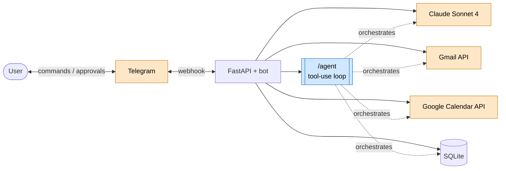

# AI Email Copilot

A personal Gmail assistant you drive entirely from Telegram. It reads and triages your
inbox with Claude, drafts replies in your chosen tone, turns meeting requests into calendar
events, and — with the `/agent` command — takes a single natural-language instruction,
plans the steps with tool-use, and proposes the actions for your one-tap approval.

[](https://github.com/H1shamM/ai-email-copilot/actions/workflows/tests.yml)
[](https://github.com/H1shamM/ai-email-copilot/actions/workflows/lint.yml)
[](https://github.com/H1shamM/ai-email-copilot/actions/workflows/deploy.yml)


> Built as the capstone for an intensive Generative-AI program — a production-deployed,
> end-to-end agentic system rather than a notebook demo. Full spec in
> [`docs/PRD.md`](docs/PRD.md); weekly build log in [`docs/PROGRESS.md`](docs/PROGRESS.md).

## The problem

Inbox triage is repetitive but context-heavy: deciding what matters, drafting the right
reply, pulling meetings onto a calendar. A plain chatbot can summarize an email, but it
can't *act* — and you don't want an AI sending mail or booking time without your say-so.

## The solution

A Telegram bot backed by a FastAPI service and Claude. Read-heavy work is automated;
anything that leaves the system (sending a reply, creating an event) is **proposed for
explicit approval first**. The headline feature is an **agent** that uses Claude's native
tool-use to plan across Gmail, Calendar, and the local store from one plain-language
request — Function Calling and Agentic Flow working together, with a human in the loop.

## Demo

🎥 **Walkthrough video:** _coming soon_

<!-- TODO: add a short screen-recording GIF (docs/assets/demo.gif) of the /agent flow and embed it here. -->

Try it from any Telegram chat with the bot:

```
/agent reply to the email from Alice accepting the meeting, and add it to my calendar
```

The agent reads the thread, drafts the reply, checks your availability, and comes back with
the proposed **send** + **create event** actions behind ✅ Approve / ✖ Cancel buttons.

## Highlights

- **Agentic tool-use** (`/agent`) — Claude plans with a curated tool registry; read-only
  tools run live, mutating tools are queued for approval. Hard iteration cap, error-tolerant
  tool results. ([deep dive](docs/ARCHITECTURE.md#agent-request-flow-the-agentic-centerpiece))
- **Approve-before-act everywhere** — replies and calendar events are always confirmed via
  inline keyboards before anything is sent or written externally.
- **Two real integrations** — Gmail (read + threaded send) and Google Calendar (event
  creation + free/busy conflict checks), both over OAuth.
- **Structured AI analysis** — every email gets a category, sentiment, urgency score, and
  suggested action; meeting requests get natural-language date resolution.
- **Proactive push** — a scheduler notifies you about high-urgency mail without polling.
- **Production-grade engineering** — single-user auth, ≥80% test coverage (currently ~92%),
  CI on every PR, and one-command auto-deploy to AWS.

## Architecture



Full system flowchart, the `/agent` sequence diagram, and a component-by-component
breakdown live in **[`docs/ARCHITECTURE.md`](docs/ARCHITECTURE.md)**.

## Commands

| Command | What it does |
|---|---|
| `/start`, `/help` | Welcome + command list |
| `/unread` | List unread emails from Gmail |
| `/analyze` | Run Claude analysis on unprocessed emails (category, urgency, action) |
| `/inbox` | Show recently analyzed emails with priority indicators |
| `/reply <id>` | Draft 3 tone-specific replies; approve / edit / regenerate / skip |
| `/schedule` | List detected meetings; create calendar events (with conflict check) |
| `/agent <text>` | Run a natural-language request through the tool-use agent |
| `/pause`, `/resume` | Toggle push notifications |

## Tech stack

**Python 3.11** · **FastAPI + uvicorn** · **Anthropic Claude Sonnet 4** (SDK with native
tool-use) · **python-telegram-bot ≥21** (webhook mode) · **Gmail API** + **Google Calendar
API** (OAuth) · **SQLite** · **APScheduler** · **pytest / pytest-cov / pytest-asyncio** ·
**black / flake8 / mypy** · **GitHub Actions** · **AWS EC2 + Caddy + systemd**.

## Getting started

### Prerequisites

- Python 3.11+
- An **Anthropic API key**
- A **Google Cloud** project with the Gmail + Calendar APIs enabled and an OAuth **client
  secrets** file saved as `credentials.json` ([Gmail API quickstart](https://developers.google.com/gmail/api/quickstart/python))
- A **Telegram bot token** from [@BotFather](https://t.me/BotFather) and your chat id from
  [@userinfobot](https://t.me/userinfobot)

### Install

```bash
python -m venv .venv
source .venv/Scripts/activate   # Windows: .venv\Scripts\activate
pip install -r requirements-dev.txt

cp .env.example .env            # then fill in the values (see Configuration)
```

### Authorize Google (first run)

```bash
python -c "from app.gmail.auth import get_credentials; get_credentials()"
```

This opens a browser consent screen for the Gmail + Calendar scopes and writes a
`token.pickle` that is refreshed automatically afterward.

### Run

```bash
uvicorn app.main:app --reload
```

Telegram delivers updates over a webhook, so for local development expose the app with a
tunnel and point `TELEGRAM_WEBHOOK_URL` at it:

```bash
cloudflared tunnel --url http://localhost:8000   # or: ngrok http 8000
```

Set `TELEGRAM_WEBHOOK_URL=https://<tunnel-host>/telegram/webhook` in `.env`, restart, and
message your bot. The webhook is registered automatically on startup.

## Configuration

All config is via `.env` (never committed). See [`.env.example`](.env.example).

| Variable | Purpose |
|---|---|
| `ANTHROPIC_API_KEY` | Claude API key |
| `GMAIL_CREDENTIALS_PATH` | OAuth client secrets JSON (default `credentials.json`) |
| `DATABASE_PATH` | SQLite file path (default `email_assistant.db`) |
| `TELEGRAM_BOT_TOKEN` | Bot token from @BotFather |
| `TELEGRAM_AUTHORIZED_CHAT_ID` | Your chat id — the only chat the bot answers |
| `TELEGRAM_WEBHOOK_URL` | Public HTTPS URL Telegram POSTs to |
| `TELEGRAM_WEBHOOK_SECRET` | Shared secret used to authenticate incoming updates |
| `TELEGRAM_PUSH_ENABLED` | Auto-start the push scheduler (`true`/`false`) |
| `TELEGRAM_PUSH_INTERVAL_MINUTES` | Scheduler tick interval (default `5`) |
| `TELEGRAM_PUSH_THRESHOLD` | Notify when `urgency_score ≥ N` (default `4`) |

## Testing & quality

```bash
pytest tests/ --cov=app     # unit suite (mocked external services); coverage gate ≥80%
black app/ tests/           # formatting (line length 100)
flake8 app/ tests/          # lint
```

- **Unit tests** are fast and fully mocked — they run in CI on every PR.
- **Integration tests** (`tests/integration/`, marked `@pytest.mark.integration`) exercise
  the real Gmail / Calendar / Claude paths and self-skip without credentials.
- Coverage, formatting, and lint are enforced by GitHub Actions; see
  [`docs/GITHUB_WORKFLOW.md`](docs/GITHUB_WORKFLOW.md) for the branch/PR/CI process.

## Deployment

Runs on a single **AWS EC2** instance behind **Caddy** (automatic HTTPS at a stable
`<eip>.nip.io` host — no domain needed), with **uvicorn under systemd**. Every push to
`main` auto-deploys via GitHub Actions using **OIDC → AWS STS → SSM `send-command`** (no
long-lived AWS keys, no SSH), then smoke-checks `/health`. Steady-state cost ≈ $5/month plus
Anthropic usage.

Step-by-step runbook: [`docs/AWS_DEPLOY.md`](docs/AWS_DEPLOY.md). Infra templates in
[`infra/`](infra/). CI/CD workflow: [`.github/workflows/deploy.yml`](.github/workflows/deploy.yml).

## Project structure

```
app/
├── main.py            FastAPI app: Telegram webhook + REST endpoints
├── ai/                Claude integration: analyzer, reply_generator, meeting_detector, agent
├── gmail/             OAuth + Gmail API client (fetch, threaded send)
├── calendar/          Google Calendar client + event scheduler (freebusy, insert)
├── database/          SQLite schema + helpers
├── telegram/          bot, command handlers, formatting, push scheduler
└── models/            Pydantic schemas
tests/
├── unit/              fast, mocked — runs in CI
└── integration/       opt-in, real APIs, self-skipping
infra/                 Caddyfile + systemd templates
docs/                  ARCHITECTURE, PRD, PROGRESS, workflow + deploy runbooks
```

## Roadmap

Week-by-week status and engineering decisions are tracked in
[`docs/PROGRESS.md`](docs/PROGRESS.md). Shipped: Telegram interface, draft replies, push
notifications, Calendar integration, the agentic `/agent` flow, and AWS deployment.