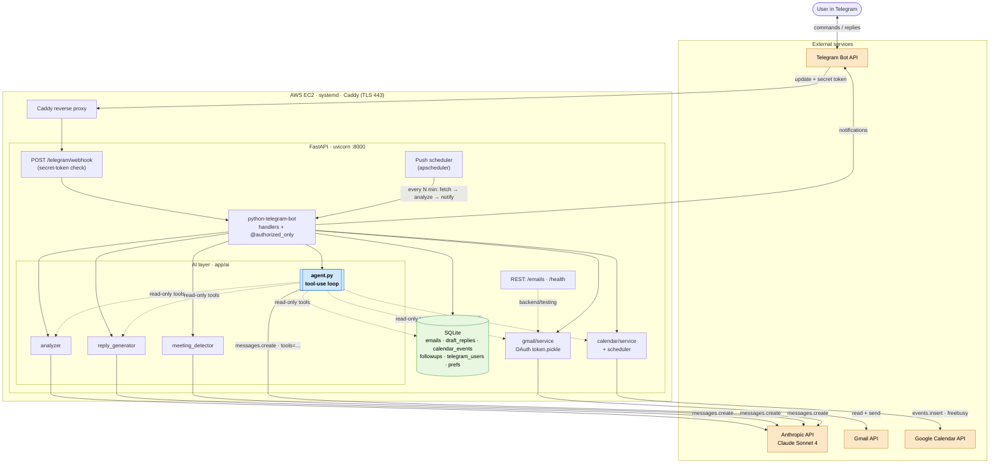
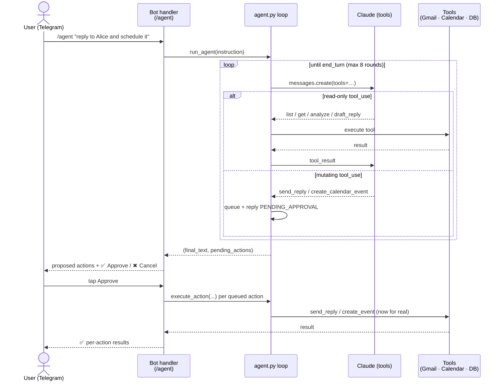

# Architecture

AI Email Copilot is a personal Gmail assistant driven entirely from Telegram. A single
FastAPI process receives Telegram updates over a webhook, routes them through the bot's
command handlers, and composes four layers — **LLM (Claude)**, **SQLite**, and the two
**external integrations (Gmail + Google Calendar)** — to read, analyze, and act on email.
The Week 5 `/agent` command ties them together: Claude plans with native tool-use, runs
read-only tools itself, and proposes mutating actions for the user to approve.

## System flowchart

## `/agent` request flow (the agentic centerpiece)

The agent satisfies the program's *advanced LLM* requirement with **both** Function Calling
and Agentic Flow. Read-only tools execute live so Claude reasons over real inbox/calendar
data; mutating tools are never run inside the loop — they are queued and gated behind
explicit user approval (the same approve-before-act model as `/reply` and `/schedule`).

## Components

| Layer | Module(s) | Responsibility |
|---|---|---|
| Entry / API | `app/main.py` | FastAPI app: `/telegram/webhook` (production traffic), `/health`, REST `/emails*` (backend/testing) |
| Bot | `app/telegram/{bot,handlers,formatting,conversations}.py` | Command routing, single-user auth (`@authorized_only`), inline-keyboard approve-before-act, MarkdownV2 formatting |
| Scheduler | `app/telegram/push.py` | Periodic unread → analyze → notify on high-urgency mail (apscheduler) |
| LLM | `app/ai/{agent,analyzer,reply_generator,meeting_detector,prompts}.py` | Claude Sonnet 4: analysis, 3-tone replies, meeting extraction, and the tool-use agent |
| Gmail | `app/gmail/{auth,service}.py` | OAuth (`token.pickle`), fetch + threaded send |
| Calendar | `app/calendar/{service,scheduler}.py` | `events.insert`, freebusy conflict check, event-body building |
| Storage | `app/database/db.py` | SQLite schema + helpers (`emails`, `draft_replies`, `calendar_events`, `followups`, `telegram_users`, `user_preferences`) |
| Deployment | `infra/`, `.github/workflows/deploy.yml` | EC2 + Caddy (auto-TLS) + systemd; GitHub Actions OIDC → SSM auto-deploy on push to `main` |

## Key flows

- **Pull command** (`/unread`, `/inbox`): Telegram → webhook → handler → Gmail/DB → formatted reply.
- **Analyze**: handler → `analyzer` → Claude → DB; if `action_required == "Schedule"`, `meeting_detector` persists a `calendar_events` row.
- **Reply / Schedule**: generate or detect → present with inline buttons → on approval, `gmail.send_reply` / `calendar.scheduler.create_event`.
- **Agent** (`/agent`): one natural-language instruction → tool-use loop (read-only live, mutating queued) → approve → execute. See the sequence diagram above.
- **Push**: scheduler tick → fetch unread → analyze → notify when `urgency_score ≥ threshold`.

> Diagrams are [Mermaid](https://mermaid.js.org/) — they render on GitHub and can be exported to PNG/SVG for the demo video via the [Mermaid Live Editor](https://mermaid.live).